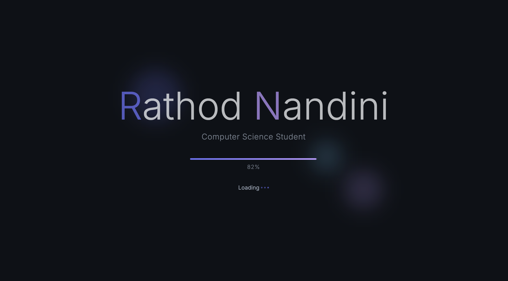
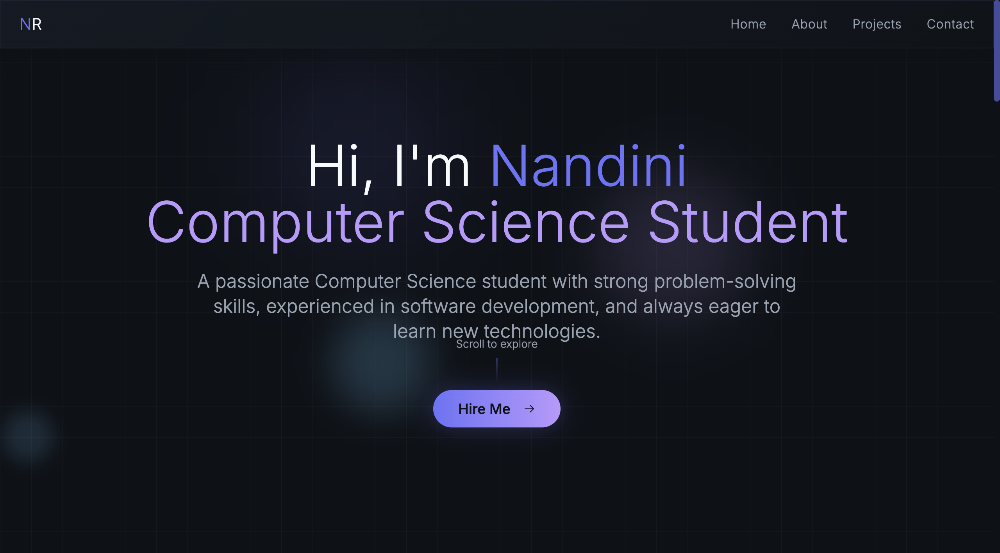
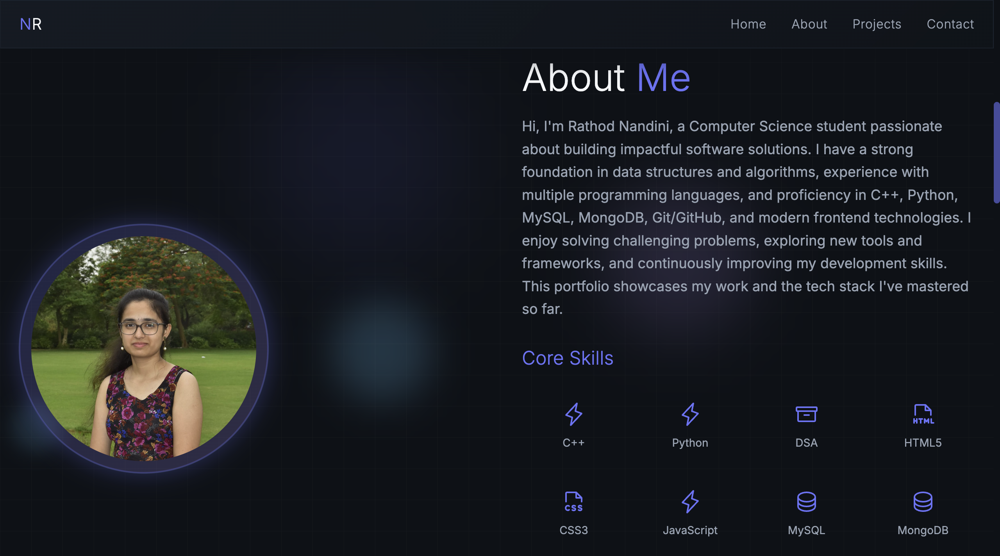
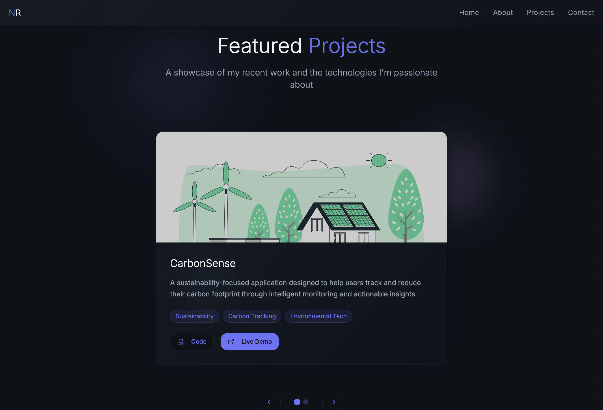
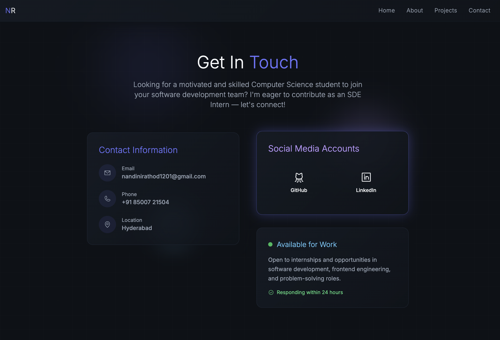
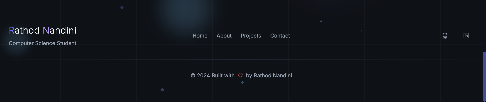

🌐 Personal Portfolio - Rathod Nandini

A modern, responsive, and interactive personal portfolio website built to showcase my skills, projects, and experience as a Computer Science Student.

This portfolio highlights my technical expertise, featured projects, and contact details, all with a sleek UI and smooth animations.

⸻

## 📸 Screenshots  

  
🔹 Loading Screen
  

    

 

  
🏠 Home Section
  

    

   

  
👩‍💻 About Me Section
  

    

  

  
📂 Featured Projects
  

    

  

  
📞 Contact Section
  

    

  

  
🔻 Footer
  

    

  
⸻

🚀 Features
	•	⚡ Smooth animations with GSAP
	•	🌙 Dark, futuristic theme with glowing effects
	•	📱 Fully responsive design
	•	🖼️ Project showcase with live demo/code links
	•	📧 Contact section with email, phone, and location
	•	🔗 Social media integration (GitHub, LinkedIn)
	•	✅ Simple and easy navigation

⸻

🛠️ Tech Stack
	•	Frontend: HTML5, CSS3, JavaScript
	•	Animations: GSAP
	•	Version Control: Git, GitHub
	•	Other: Responsive design principles

⸻

📂 Sections
	1.	Loading Page – Interactive loading bar before entry.
	2.	Home – Introduction with a call-to-action “Hire Me”.
	3.	About Me – Personal introduction, profile photo, and core skills.
	4.	Projects – Featured work with tags, code, and live demo.
	5.	Contact – Email, phone, location, and social media links.
	6.	Footer – Branding and copyright.

⸻

⚡ Live Demo

👉 https://nandini-rathod.github.io/Protfolio/